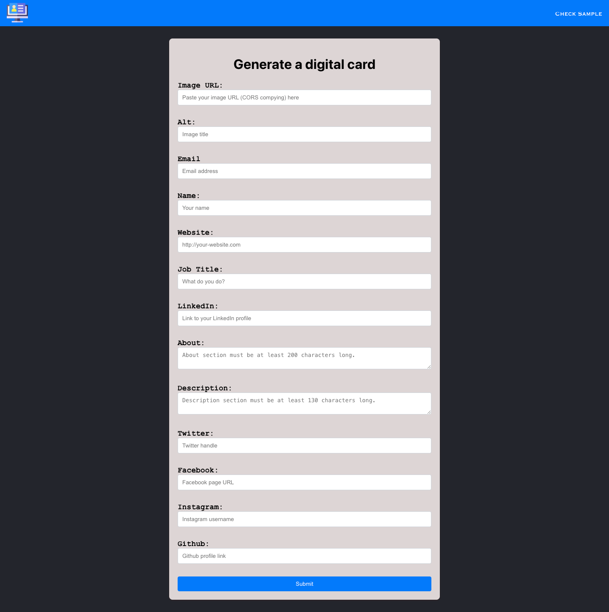
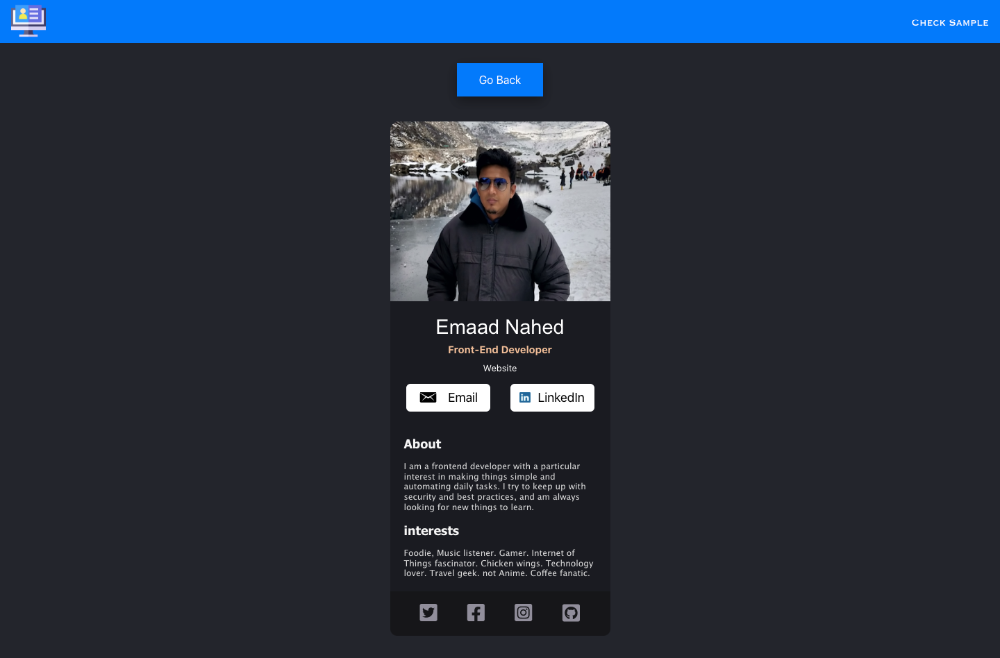

## Table of Contents:

* Motivation
* Why this project?
* Project Description:
* Screenshot and link reference
* How to Install and Run the Project?
* The learning Process

# Motivation

This project is a web application developed with React and the react-router-dom library. Its purpose is to showcase and manage a collection of digital cards, offering a user-friendly experience for creating, editing, and viewing them seamlessly. The homepage features a Navbar for navigation, leading to the FormCollection component for managing cards. This component is a dynamic form capable of handling multiple cards with various properties. A Samplecard component demonstrates the potential design and functionality of digital cards. Additionally, a DigitalCard component allows users to view and interact with individual cards in detail. Overall, the project demonstrates how React and react-router-dom can be utilized to create intuitive web applications for managing digital content effectively.


# Why this project?

This project is a web application developed with React and the react-router-dom library. Its purpose is to showcase data provided as a digital card, offering a user-friendly experience with simplification seamlessly. The homepage features a Navbar for navigation, leading to the FormCollection component for creating a digital card. This component is a dynamic form capable of handling creation of digital card with various properties. A Samplecard component demonstrates the potential design and functionality of digital card. Additionally, a DigitalCard component allows users to view and interact with individual cards in detail. Overall, the project demonstrates how React and react-router-dom can be utilized to create intuitive web applications for managing digital content effectively.


# Project Description

You will basically need to fill the form with the requested information and the digital card will be created for anyone.

This project is a simple web application built using React and the `react-router-dom` library for routing. The application has a navigation bar component (`Navbar`) which is the parent component of all other components in the application. The default route (`"/"`) displays the `FormCollection` component. There are two other routes defined - `"/samplecard"` which displays the `Samplecard` component and `"/DigitalCard"` which displays the `DigitalCard` component.


# Screenshot and link reference

Below is the landing page wherein form is required to be filled.




Below is the page which is a sample of how the digital card looks when created:




# How to Install and Run the Project?

Quick start:

```
$ npm install
$ npm start
```


# The learning Process

- Composing the props receiving component which receives the props and applies it to make a digital card.
- Composing a component which collects, handles and processes the received information.
- Creating Routes for default landing page and the page to where it navigates upon form filling.
- passing state through useNavigate.
- A sample digital card to showcase how it looks like.
